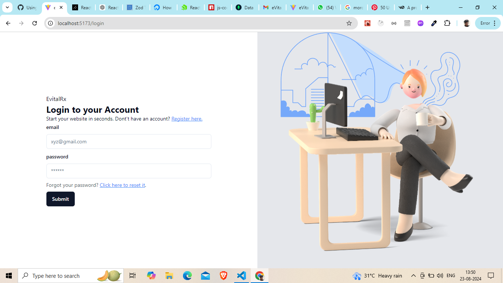
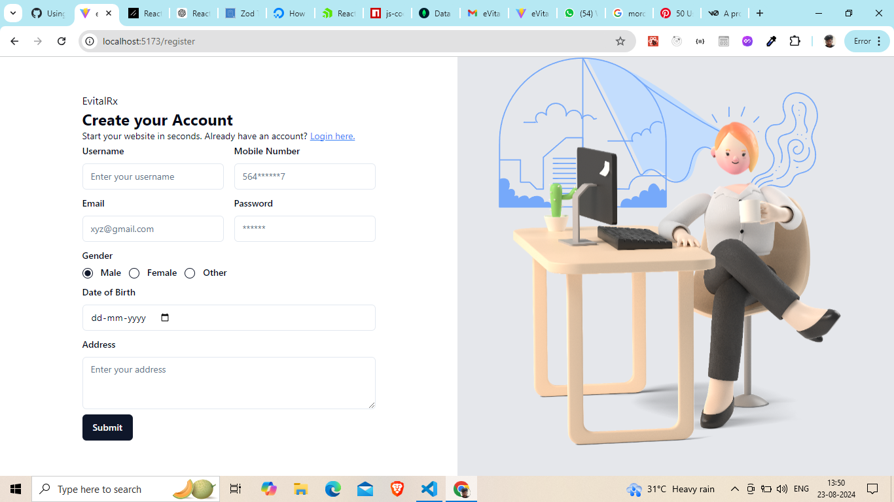
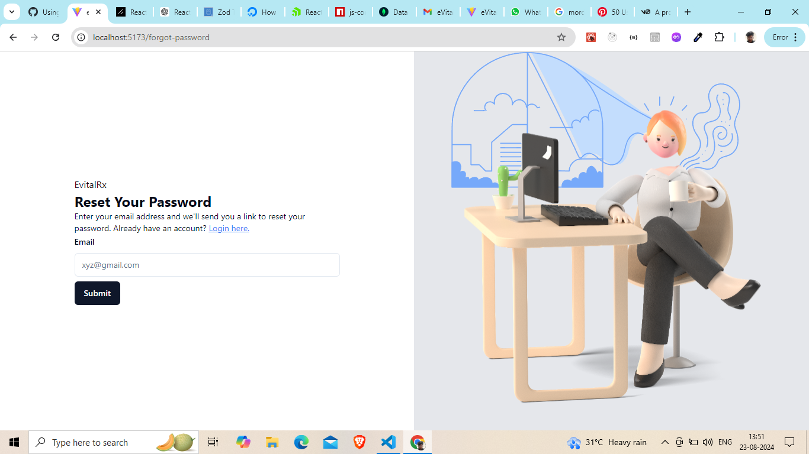
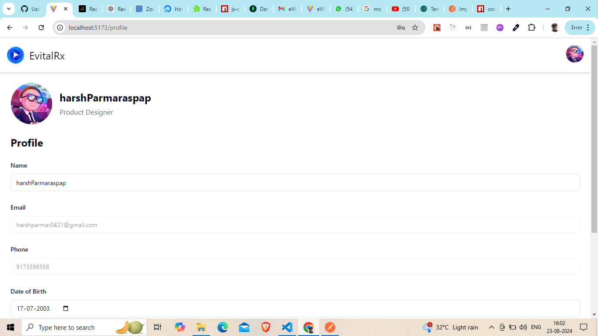
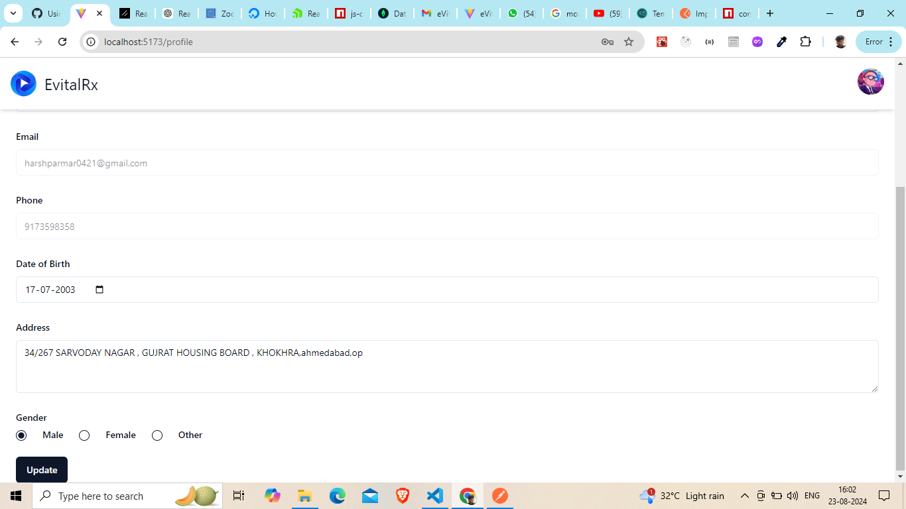

Here's a README file for your project based on the task description and the work you've done:

---

# Fullstack Developer EvitalRx task

## Project Overview

This project is a full-stack web application designed to demonstrate core competencies in both frontend and backend development. The application includes user authentication, profile management, and secure password management features. The frontend is built using React, and the backend is developed using Node.js and Express. 

## Features

- **Signup API**: Allows users to create an account by providing their name, mobile number, email, date of birth (DOB), gender, and address. Includes an OTP (One-Time Password) verification sent via email.
- **Login API**: Enables users to log in using their email and password.
- **Forgot Password API**: Allows users to request a password reset by sending a reset link to their registered email.
- **Reset Password API**: Lets users reset their password using the link provided by the Forgot Password API.
- **Profile Update API**: Enables users to update their profile information, including name , DOB, gender, and address.

## Technologies Used

### Frontend
- **React**: A JavaScript library for building user interfaces.
- **React Router**: Used for navigation between different pages.
- **React Hook Form**: For form handling and validation.
- **Zod**: For schema-based form validation.
- **Tailwind CSS**: A utility-first CSS framework for styling.
- **Shad-Cn**:An Component Base ui Library 

### Backend
- **Node.js**: A JavaScript runtime for building server-side applications.
- **Express**: A web application framework for Node.js.
- **MongoDB**: A NoSQL database for storing user information.
- **Mongoose**: An ODM (Object Data Modeling) library for MongoDB and Node.js.
- **JWT**: For secure user authentication and token management.
- **Nodemailer**: For sending OTP emails.

## Setup Instructions

### Prerequisites

- **Node.js**: Ensure that Node.js is installed on your machine.
- **MongoDB**: You need to have MongoDB installed locally or have access to a MongoDB Atlas cluster.

### Backend Setup

1. **Clone the Repository**:
   ```bash
   git clone <repository-url>
   cd <repository-directory>
   ```

2. **Install Dependencies**:
   ```bash
   cd backend
   npm install
   ```

3. **Environment Variables**:
   Create a `.env` file in the `backend` directory and add the following environment variables:
```bash
   PORT=4000
   MONGO_URI=mongodb+srv://<username>:<password>@<cluster-url>/<database> 
   NODE_ENV=<development>
   ACCESS_TOKEN="<your-access-token>"
   ACCESS_TOKEN_EXPIRES_TIME=24
   REFRESH_TOKEN="<your-refresh-token>"
   REFRESH_TOKEN_EXPIRES_TIME=7
   JWT_SECRET=<your-jwt-secret>
   JWT_EXPIRES_TIME="5m"
   JWT_TOKEN_EXPIRES_TIME="1d"
   JWT_REFRESH_EXPIRES_TIME="7d"
   SMTP_HOST=smtp.gmail.com
   SMTP_PORT=465
   SMTP_SERVICE=gmail
   SMTP_EMAIL=<your-email>
   SMTP_PASSWORD=<your-email-password>
   
   
```


4. **Run the Backend Server**:
   ```bash
   npm run dev
   ```

### Frontend Setup

1. **Navigate to the Frontend Directory**:
   ```bash
   cd frontend
   ```

2. **Install Dependencies**:
   ```bash
   npm install
   ```

3. **Run the Frontend**:
   ```bash
   npm run dev 
   ```

## API Documentation

For detailed API documentation, including request and response formats, please refer to the Postman Documentation.


## ScreenShot








 

 


## Conclusion

This project is a demonstration of my skills as a Fullstack Developer. The application meets the requirements and can be further extended with more features as needed. 

Thank you for the opportunity to work on this assignment.

## Author

- **Harsh** - [LinkedIn](https://www.linkedin.com/in/harsh) | [GitHub](https://github.com/harsh)

---

This README covers all aspects of the project, from setup to evaluation criteria. Adjust paths, environment variables, and other specific details as needed.
